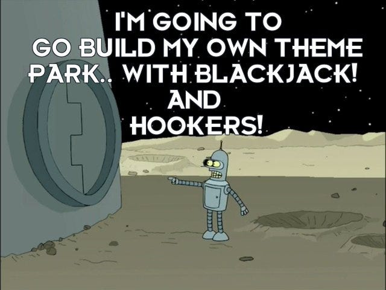
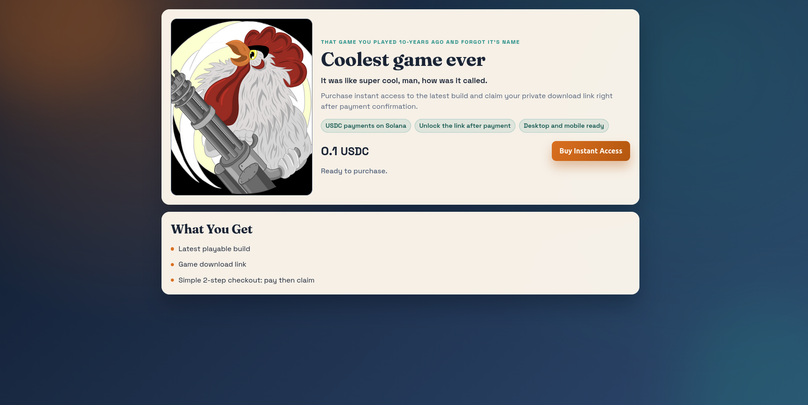
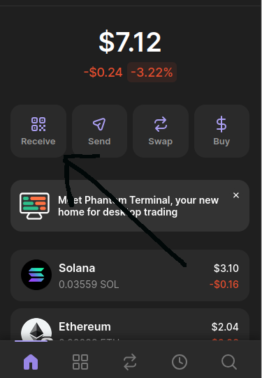
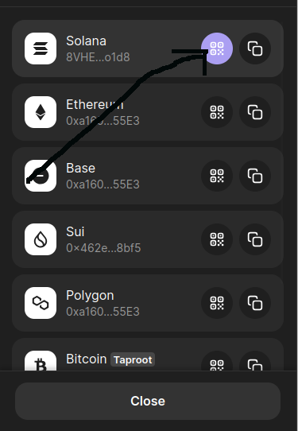
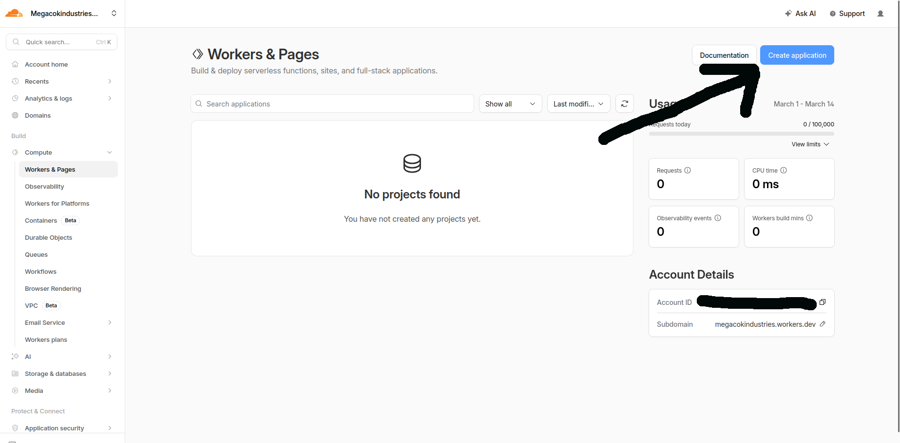
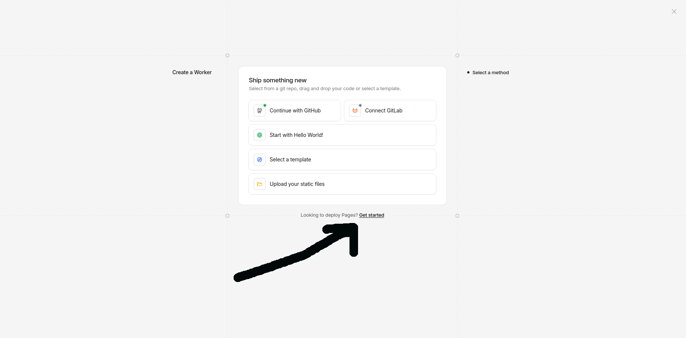
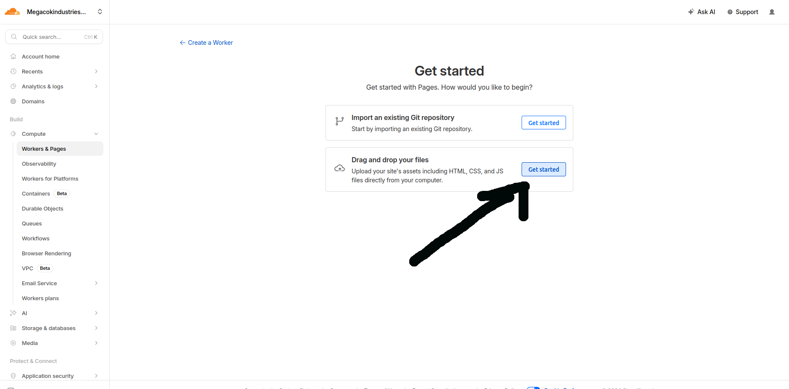
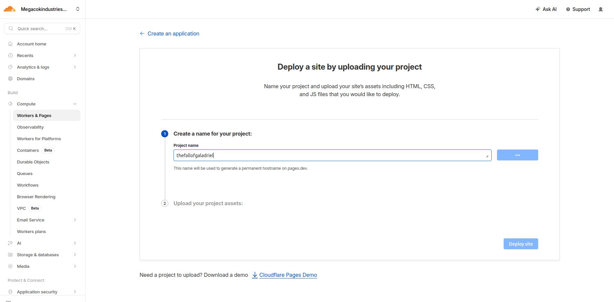
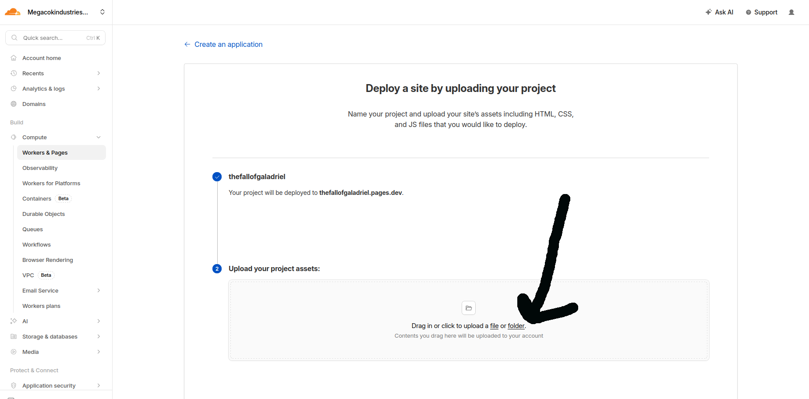
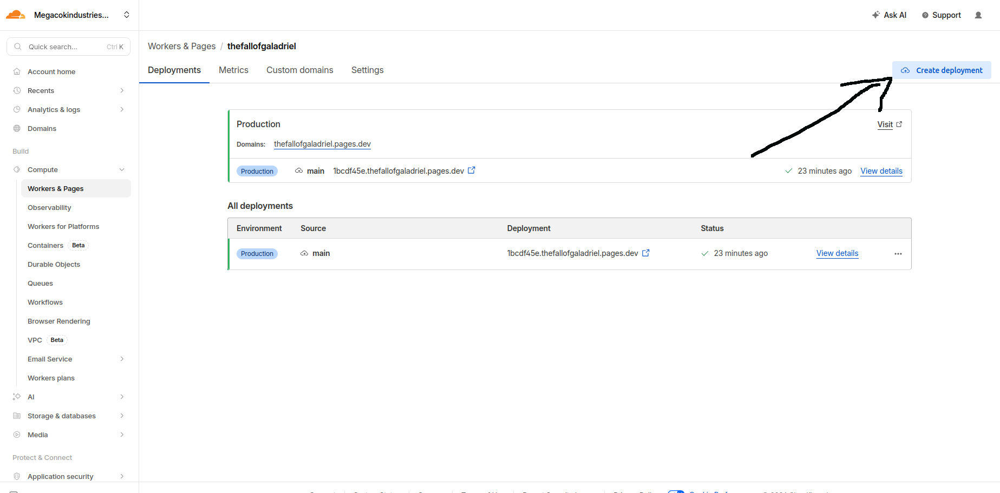

# Megavest - DIY kit for building simple crypto storefront (Cloudflare Pages + AWS Lambda + Solana)

Dark times are coming, my fellow indie devs. Game stores change their TOS whenever they like, and one day any one of us can wake up to find our creations removed. The reason is often payment processor pressure. In addition to that risk, in some countries VISA/Mastercard simply do not work, so our loyal subscribers get cut off and are forced to pirate games.

Is there any solution to that? Can an ordinary dev do something about it? My answer to that is Megavest.

What is "Megavest"? It's the car first aid kit you bought 5 years ago and forgot about, until you get into a car accident. It's the parachute you find under your seat when the plane starts falling. It's the life vest your paranoid wife gives you every time you go fishing, when your boat starts to sink.

In other words, it's your backup payment option when you get banned and/or your subscribers can't send you money. Basically a mini-store with only one game - your game. It can accept payment in crypto and deliver your customer game link.

<p align="center">
  <a href="https://www.youtube.com/watch?v=ubPWaDWcOLU">
    
  </a>
</p>

Here is how your final webpage can look like: https://thecoolestgameever.pages.dev/ . Ofc, you can change the design, all the frontend files are in docs folder.



## FAQ
- Is it subject to payment processor pressure? - No, it runs on crypto, payments are in USDC.
- How much? - Free of charge, but you pay with your time. You will have to set it up yourself.
- What's your commission? - Zero, I don't profit from it.
- Can I modify it? - Yes, the code is open-source, do what you want with it.
- I need support to set it up - Well, that's a tricky one. I have tons of other projects, and since I don't really profit from this one, I can't spend much time helping everyone.
- Is it self-hosted? - It's hosted under your accounts (Amazon + Cloudflare), this setup has no monthly fees.
- If a user pays me 10 bucks, how much do I get? - 9.99 bucks, or around that value. USDC has small transaction fees.
- My users have USDC, but can't pay! - Check if they have SOL. USDC payments require some SOL in their account to make the payment.
- Are contributions welcome? - Yep.
- People say crypto is private. Is that true? - Nope, not really. The network is visible to everyone, so anyone can check which wallet sent money to which other wallet. No names, of course, just wallet addresses. So don’t do stupid stuff, and don’t try to sell anything illegal.

Simple flow:
1. User clicks **Buy** on your Cloudflare Pages site.
2. Site calls `POST /create-order`.
3. QR code (Solana Pay URI) is shown.
4. Site polls `GET /check-payment`.
5. When paid, user clicks **Get Link** -> `GET /claim-link`.

## Project structure

- `docs/` static files for Cloudflare Pages
- `backend/` Python Lambda code + AWS SAM template
- `backend/lambdas/create_order/` create order and return payment QR data
- `backend/lambdas/check_payment/` verify payment on Solana RPC
- `backend/lambdas/claim_link/` return your game link after payment
- `backend/lambdas/get_storefront/` return public storefront settings (product name + price)

## What you need to do before deployment
- register amazon AWS account for hosting backend, set up amazon CLI so you can use Amazon SAM.
- register cloudflare account.
- set-up USDC Solana wallet, I use Phantom wallet.
- check your wallet address, it will be needed later.
   





## Deployment order

1. Deploy frontend to Cloudflare Pages first (to get your `https://<name>.pages.dev` URL).
2. Run `sam deploy --guided` and set `CorsAllowOrigin` to that Cloudflare Pages URL.
3. Update `docs/config.js` with backend `ApiBaseUrl`.
4. Re-deploy the `docs/` folder to Cloudflare Pages.
5. If you later want to change the link or pricing, you can do sam deploy --guided again.

## What you need to do after deployment
- Try doing some small payment to yourself and see if the link is delivered correctly and the money reached your wallet.

## Frontend deploy (Cloudflare Pages Free - drag and drop)

1. Edit `docs/config.js`:

```js
window.APP_CONFIG = {
  apiBaseUrl: "https://YOUR_API_ID.execute-api.YOUR_REGION.amazonaws.com",
  storefrontConfigPath: "/storefront-config",
  productName: "My Game",
  productEyebrow: "Fantasy Action RPG",
  productTagline: "Step into a world of ruins, magic, and hard choices.",
  productDescription: "Short product pitch shown near the buy button.",
  coverImageUrl: "./assets/images/cover.png",
  coverImageAlt: "Cover art for My Game",
  buyButtonLabel: "Buy Instant Access",
  highlights: ["USDC on Solana", "Instant unlock", "Mobile friendly"],
  productDetails: ["Current playable build", "Private game link", "Fast 2-step checkout"],
};
```

2. Add your cover image at `docs/assets/images/cover.png` (or change `coverImageUrl`).
3. In Cloudflare dashboard, click **Create application**.



4. Choose **Pages**.



5. Choose **Drag and drop your files**.



6. Create a project name.



7. Choose the `docs/` folder and deploy.



8. Save your deployed URL, for example `https://your-project.pages.dev`.

## Backend deploy (AWS SAM)

Prereqs:
- AWS CLI configured
- AWS SAM CLI installed
- Python 3.10

Commands:

```bash
cd backend
sam build
sam deploy --guided
```

Use these values in `--guided` prompts:
- `MerchantWallet`: your Solana wallet address that receives USDC
- `ProductLink`: your MEGA folder/game link
- `ProductName`: display name (for wallet payment prompt)
- `PriceUsdc`: price in USDC (example `5`)
- `SplTokenMint`: keep default for mainnet USDC (`EPjFWdd5AufqSSqeM2qN1xzybapC8G4wEGGkZwyTDt1v`)
- `TokenDecimals`: keep `6` for USDC
- `SolanaRpcUrl`: keep default or set your own RPC provider URL
- `CorsAllowOrigin`: your Cloudflare Pages URL, for example `https://your-project.pages.dev`

After deploy:
1. Copy output `ApiBaseUrl`.
2. Update `docs/config.js` -> `apiBaseUrl`.
3. Re-deploy the `docs/` folder to Cloudflare Pages.

4. Product name and price are loaded from `GET /storefront-config` on every page load.
## API contracts

### `POST /create-order`
Response:
```json
{
  "order_id": "uuid",
  "claim_token": "secret-token",
  "payment_uri": "solana:...",
  "reference": "solana-reference-public-key",
  "product_name": "My Game",
  "amount_usdc": "5",
  "expires_at": "ISO timestamp"
}
```

### `GET /storefront-config`
Response:
```json
{
  "productName": "My Game",
  "priceUsdc": "5"
}
```

### `GET /check-payment?order_id=...`
Response examples:
```json
{"paid": false, "status": "PENDING"}
```
```json
{"paid": true, "status": "PAID", "tx_signature": "...", "claimed": false}
```

### `GET /claim-link?order_id=...&claim_token=...`
Response:
```json
{"order_id": "...", "download_url": "https://...", "status": "CLAIMED"}
```

## Notes

- This starter verifies **SPL token transfers** for a configured mint (default: mainnet USDC).
- Orders expire (`ORDER_TTL_MINUTES`, default 30) and auto-clean via DynamoDB TTL.
- For production, use a dedicated RPC provider and restrict `CorsAllowOrigin` to your real domain.


## SAM installation Ubuntu
sudo apt update && sudo apt install -y unzip
curl -Lo aws-sam-cli-linux-x86_64.zip https://github.com/aws/aws-sam-cli/releases/latest/download/aws-sam-cli-linux-x86_64.zip
unzip aws-sam-cli-linux-x86_64.zip -d sam-installation
sudo ./sam-installation/install
sam --version

## SAM configuration example
Stack Name [sam-app]: megavest-app

AWS Region [eu-north-1]: 

Parameter MerchantWallet []: ADD YOUR SOLANA USDC WALLET ADDRESS (For example 8VHEJ7rsH5bKsrQ2AucjspVw8WG5o1Kpo8apX14qo1d8)

Parameter ProductLink []: ADD LINK TO YOUR GAME(For example in Mega)

Parameter ProductName [My Game]: test game

Parameter PriceUsdc [5]: 

Parameter SplTokenMint [EPjFWdd5AufqSSqeM2qN1xzybapC8G4wEGGkZwyTDt1v]: 

Parameter TokenDecimals [6]: 

Parameter SolanaRpcUrl [https://api.mainnet-beta.solana.com]: 

Parameter CorsAllowOrigin [*]: CHANGE THIS TO YOUR WEBSITE https://thecoolestgameever.pages.dev

Parameter OrderTtlMinutes [30]: 

#Shows you resources changes to be deployed and require a 'Y' to initiate deploy

Confirm changes before deploy [y/N]: Y

#SAM needs permission to be able to create roles to connect to the resources in your template

Allow SAM CLI IAM role creation [Y/n]: Y

#Preserves the state of previously provisioned resources when an operation fails

Disable rollback [y/N]: N

CreateOrderFunction has no authentication. Is this okay? [y/N]: y

CheckPaymentFunction has no authentication. Is this okay? [y/N]: y

ClaimLinkFunction has no authentication. Is this okay? [y/N]: y

StorefrontConfigFunction has no authentication. Is this okay? [y/N]: y

Save arguments to configuration file [Y/n]: Y

SAM configuration file [samconfig.toml]: 

SAM configuration environment [default]:

## Support this project

USDC (Solana) address: `8VHEJ7rsH5bKsrQ2AucjspVw8WG5o1Kpo8apX14qo1d8`

## License

This project is licensed under the MIT License. See the [LICENSE](./LICENSE) file for details.
